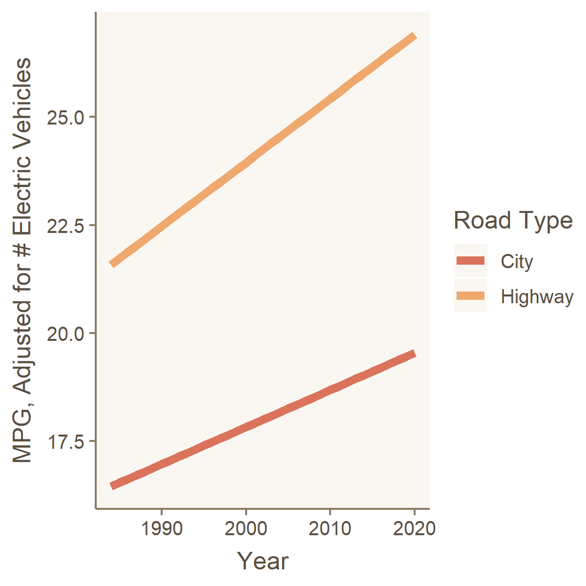

This #TidyTuesday challenged us to explore data about car fuel economy.

I wanted to know whether cars are getting more fuel efficient over time, and if so, why?

I found that **cars are getting more fuel efficient, but more so on the highway than in the city.** I was also curious if this was due to the growth of electric vehicles. I found that **this is still true, controlling for the growth of electric vehicles** using linear regression. 

