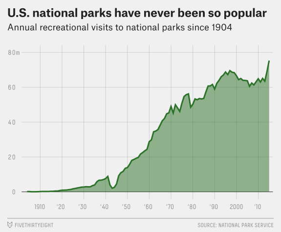
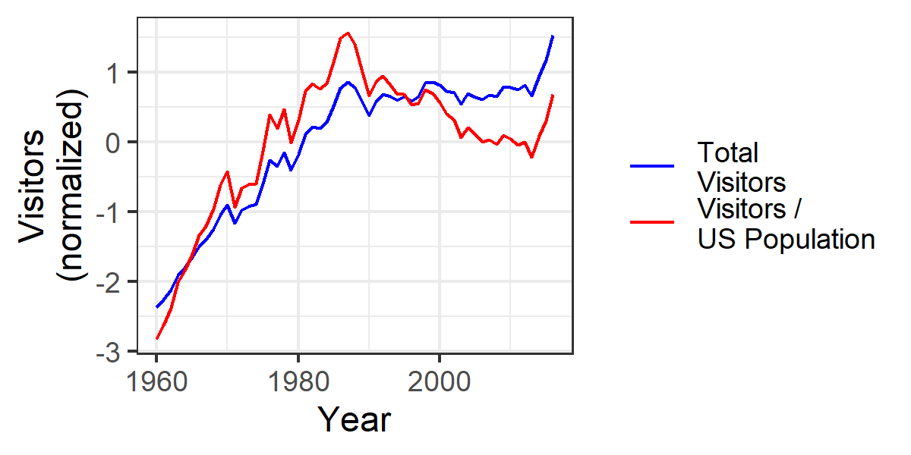

This #TidyTuesday challenged us to explore national park data.

FiveThirtyEight had reported that national parks are "have never been more popular."

I found this isn't right. What's actually happening is the US population is growing fast. When you adjust for population, national park attendance has been declining since the mid-1980s.

