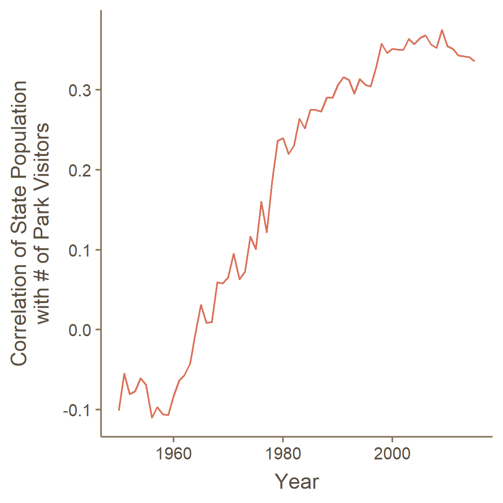

This #TidyTuesday challenged us to explore national park data.

FiveThirtyEight had reported that national parks "have never been more popular." https://fivethirtyeight.com/features/the-national-parks-have-never-been-more-popular/

I found this isn't right. What's actually happening is the US population is growing fast. When you adjust for population, national park attendance has been declining since the mid-1980s.

I also checked whether people are traveling more (or less) to visit state parks. I found that people are traveling LESS. I did this by correlating visitors with a state's population, the idea being that a lower correlation should indicate more out-of-town visitors.

