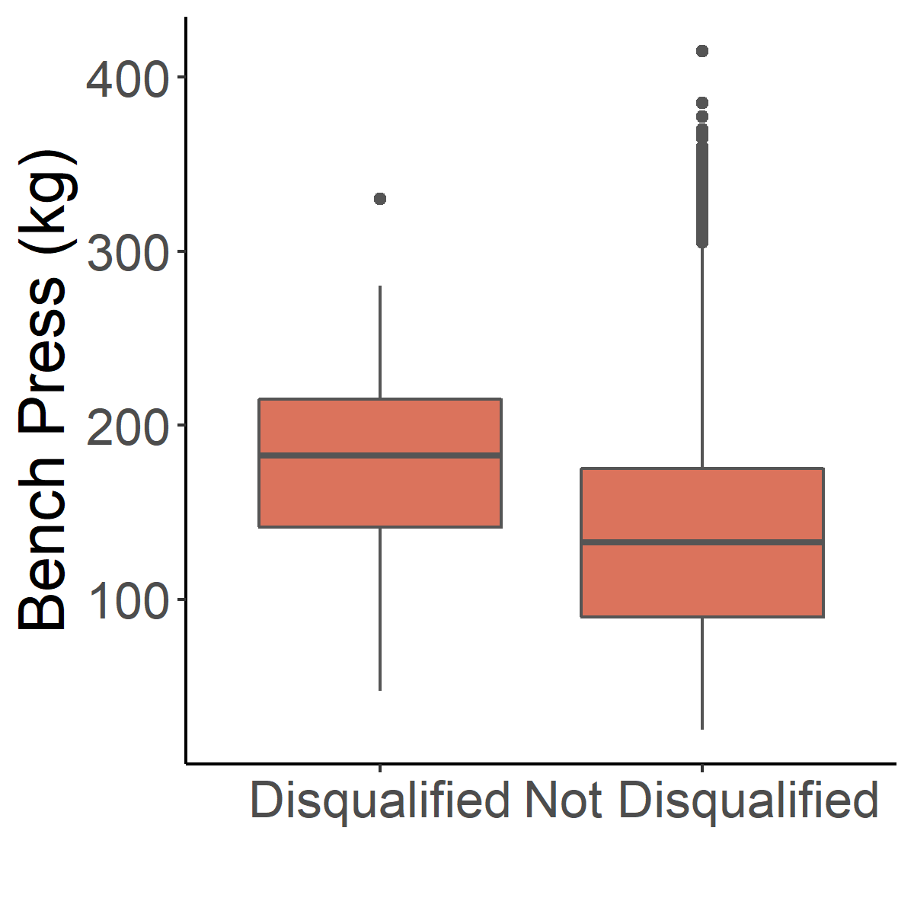

This #TidyTuesday challenged us to explore weightlifting data.

For me, the most interesting feature is that data are available for weightlifters who were disqualified after the event for doping violations. This allowed me to ask a simple question: does doping really help? (and if so, how much?)

First, I found that doping adds roughly 40kg to a lifter's overall performance. 

Now you might worry that this better performance could be explained by other factors. For example, maybe older lifters (who already perform better) are more likely to use performance-enhancing drugs. I ruled this out. In multiple linear regression factoring the body weight, age, and gender of the lifter, I found that being disqualified for doping had an independent effect on the lifter's bench press (adding 18 KG +/- 6).

