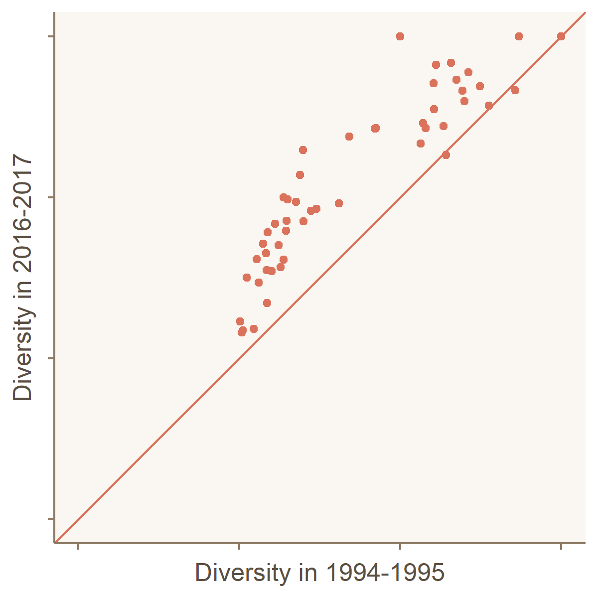

This #TidyTuesday challenged us to explore data about diversity in US School Districts.

I found that while US school districts are becoming more diverse as a whole, the same districts that were diverse in the 1990s are still the most diverse in the 2010s. 

