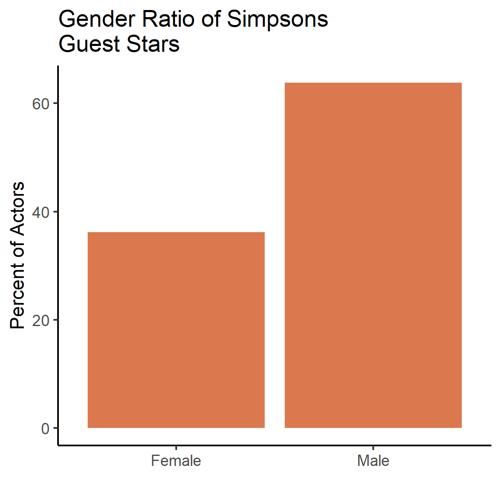
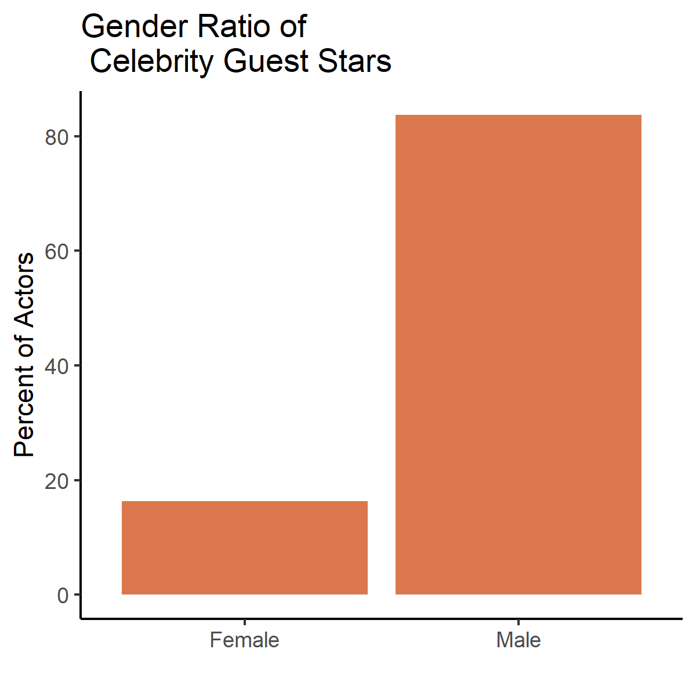

This #TidyTuesday challenged us to explore data about Guest stars on the TV show The Simpsons.

I found that guest stars are largely male, and that this pattern has been relatively constant over the 25-year lifetime of the show.

The gap was especially acute for celebrity guests, appearing as "himself" or "herself". Over 80% of these were male. 

I identified the gender of the guest stars using a lovely API from Namsor: https://www.namsor.com/
